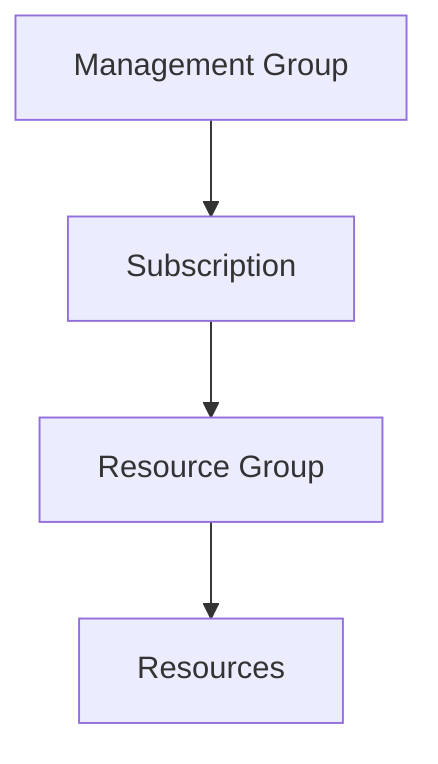
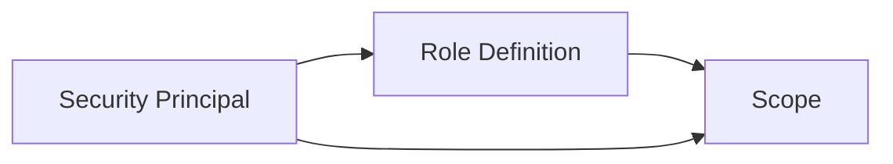
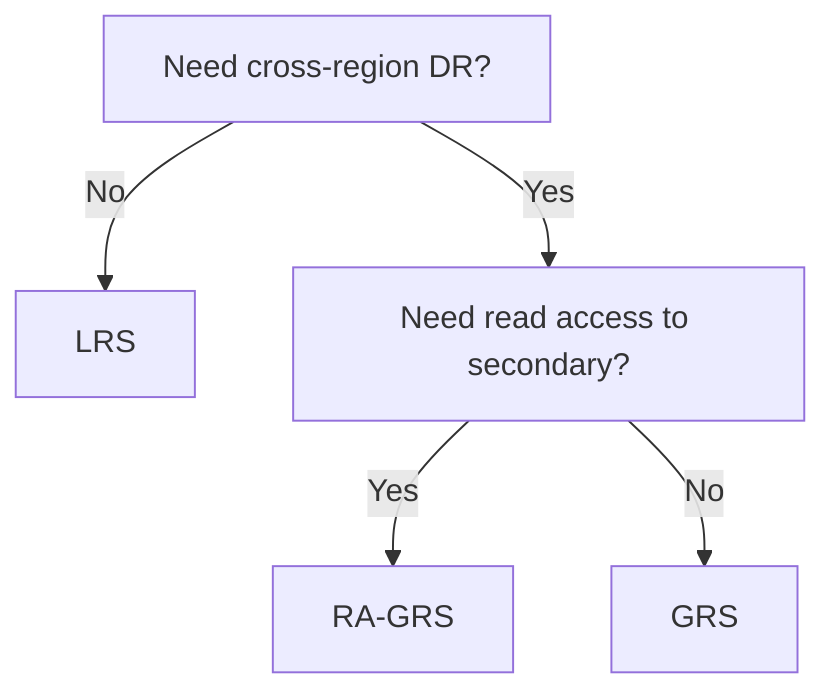
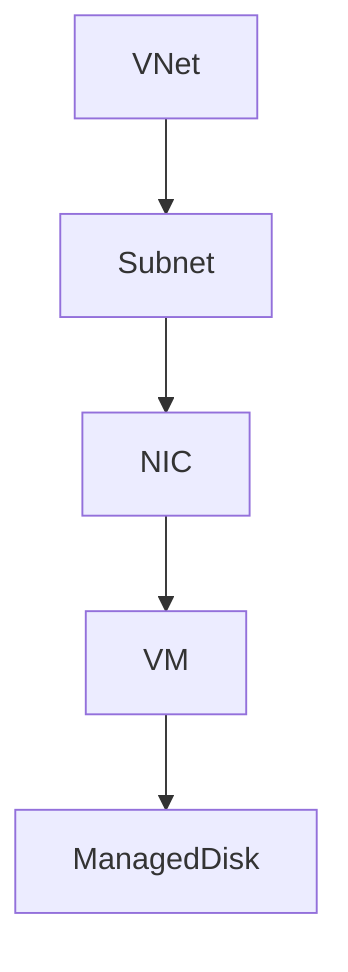
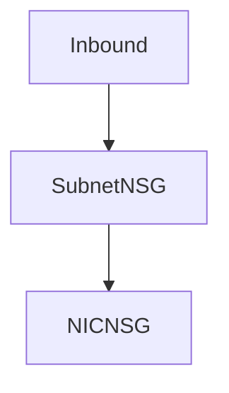
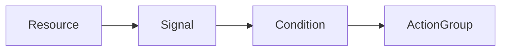
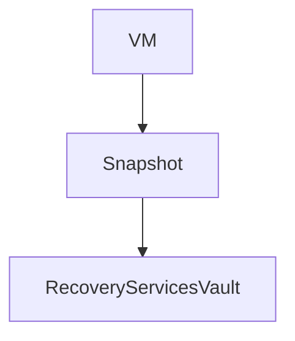
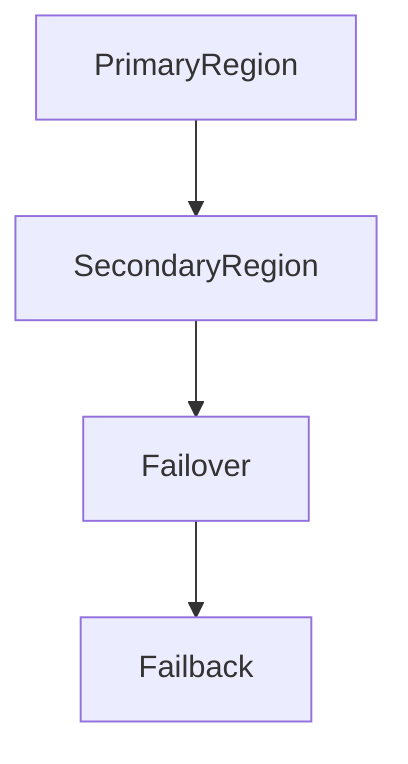

# AZ-104 Full-Length Detailed Study Guide

Microsoft Azure Administrator Associate

------------------------------------------------------------------------

## Table of Contents

1. [DOMAIN 1 -- Manage Azure Identities and Governance (20--25%)](#domain-1----manage-azure-identities-and-governance-20--25)
  - [Microsoft Entra ID (Azure AD)](#microsoft-entra-id-azure-ad)
  - [Users and Groups](#users-and-groups)
  - [Role-Based Access Control (RBAC)](#role-based-access-control-rbac)
  - [Azure Policy](#azure-policy)
  - [Resource Locks](#resource-locks)
2. [DOMAIN 2 -- Implement and Manage Storage (15--20%)](#domain-2----implement-and-manage-storage-15--20)
  - [Storage Account Types](#storage-account-types)
  - [Replication Options](#replication-options)
  - [Blob Storage](#blob-storage)
  - [Shared Access Signatures (SAS)](#shared-access-signatures-sas)
  - [Azure Files](#azure-files)
3. [DOMAIN 3 -- Deploy and Manage Azure Compute Resources (20--25%)](#domain-3----deploy-and-manage-azure-compute-resources-20--25)
  - [Virtual Machines](#virtual-machines)
  - [Availability](#availability)
  - [Scaling](#scaling)
  - [Azure Bastion](#azure-bastion)
4. [DOMAIN 4 -- Configure and Manage Virtual Networking (15--20%)](#domain-4----configure-and-manage-virtual-networking-15--20)
  - [Virtual Networks](#virtual-networks)
  - [Network Security Groups (NSGs)](#network-security-groups-nsgs)
  - [Application Security Groups](#application-security-groups)
  - [VNet Peering](#vnet-peering)
  - [Routing](#routing)
  - [Service Endpoints vs Private Endpoints](#service-endpoints-vs-private-endpoints)
  - [Load Balancer vs Application Gateway](#load-balancer-vs-application-gateway)
  - [Network Watcher](#network-watcher)
5. [DOMAIN 5 -- Monitor and Maintain Azure Resources (10--15%)](#domain-5----monitor-and-maintain-azure-resources-10--15)
  - [Azure Monitor](#azure-monitor)
  - [Log Analytics Workspace](#log-analytics-workspace)
  - [Alerts](#alerts)
6. [DOMAIN 6 -- Backup and Recovery (10--15%)](#domain-6----backup-and-recovery-10--15)
  - [Azure Backup](#azure-backup)
  - [Soft Delete](#soft-delete)
  - [Azure Site Recovery](#azure-site-recovery)
7. [Advanced Topics & Implementation Examples](#advanced-topics--implementation-examples)
  - [Identity Architecture](#identity-architecture-overview)
  - [RBAC Deep Dive](#rbac-deep-dive)
  - [Storage Strategies](#storage-replication-strategy-decision-tree)
  - [Compute Implementation](#vm-deployment-flow)
  - [Networking Evaluation](#nsg-evaluation-order)
  - [Monitoring Architecture](#alert-architecture)
  - [Disaster Recovery](#backup-architecture)
8. [Real-World Scenarios](#real-world-scenario-drill)
9. [Final Exam Strategy](#final-exam-strategy)

------------------------------------------------------------------------

## DOMAIN 1 -- Manage Azure Identities and Governance (20--25%)

### Microsoft Entra ID (Azure AD)

#### Core Concepts

Microsoft Entra ID is a cloud-based identity provider that:

- Uses modern auth protocols (OAuth, SAML, OpenID Connect)
- Provides SSO, MFA, Conditional Access
- Uses a flat structure (no OUs, no GPOs)
- Supports federation

#### Administrative Roles

- Global Administrator
- User Administrator
- Privileged Role Administrator

#### Self-Service Password Reset (SSPR)

- Configure authentication methods (email, phone, questions)
- Require registration
- Integrates with MFA
- Supports hybrid environments

------------------------------------------------------------------------

### Users and Groups

#### User Management

- 30-day soft delete retention
- Bulk import via CSV
- Manage usage location for licensing
- Invite guest users (B2B)

#### Group Types

- Security Groups
- Microsoft 365 Groups

#### Membership Types

- Assigned
- Dynamic (user/device)

------------------------------------------------------------------------

### Role-Based Access Control (RBAC)

#### Key Concepts

- Security Principal
- Role Definition
- Scope
- Assignment

#### Scope Hierarchy

Management Group → Subscription → Resource Group → Resource

#### Built-In Roles

- Owner
- Contributor
- Reader
- User Access Administrator

Custom roles can be created via JSON.

------------------------------------------------------------------------

### Azure Policy

- Enforce standards
- Audit or deny configurations
- Remediation tasks
- Policy Initiatives group policies together

------------------------------------------------------------------------

### Resource Locks

- ReadOnly (prevents modification)
- Delete (prevents deletion)
- Inherited down the scope chain

------------------------------------------------------------------------

## DOMAIN 2 -- Implement and Manage Storage (15--20%)

### Storage Account Types

- General Purpose v2 (recommended)
- Premium Block Blob
- Premium File Shares

### Replication Options

| Type    | Zones | Regions | Read Access |
|---------|-------|---------|-------------|
| LRS     | 1     | 1       | No          |
| ZRS     | 3     | 1       | No          |
| GRS     | 1     | 2       | No          |
| RA-GRS  | 1     | 2       | Yes         |
| GZRS    | 3     | 2       | No          |
| RA-GZRS | 3     | 2       | Yes         |

### Blob Storage

- Object storage
- Access tiers: Hot, Cool, Cold, Archive
- Lifecycle management rules
- Object replication

### Shared Access Signatures (SAS)

- Service SAS
- Account SAS
- User Delegation SAS
- Signed URI with expiration & permissions

### Azure Files

- SMB 3.0
- Port 445 required
- Snapshots & soft delete (1--365 days)

------------------------------------------------------------------------

## DOMAIN 3 -- Deploy and Manage Azure Compute Resources (20--25%)

### Virtual Machines

#### VM Planning

- Region selection
- VM sizing (CPU, memory)
- Pricing considerations

#### Disks

- OS disk
- Temporary disk
- Data disks
- Managed disks (Standard/Premium/Ultra)

### Availability

| Option            | SLA    |
|-------------------|--------|
| Single VM         | None   |
| Availability Set  | 99.95% |
| Availability Zone | 99.99% |

#### Update vs Fault Domains

- Update Domain = planned maintenance isolation
- Fault Domain = hardware failure isolation

### Scaling

- Vertical scaling (resize VM)
- Horizontal scaling (VM Scale Sets)
- Autoscale rules (CPU, memory, schedule)

### Azure Bastion

- Secure RDP/SSH via browser
- No public IP required

------------------------------------------------------------------------

## DOMAIN 4 -- Configure and Manage Virtual Networking (15--20%)

### Virtual Networks

- Non-overlapping address space
- Subnets must not overlap
- Private and public IP addressing

### Network Security Groups (NSGs)

- Inbound/outbound rules
- Priority order (lower = higher priority)
- Evaluated at subnet & NIC

### Application Security Groups

- Logical VM grouping
- Used in NSG rules

### VNet Peering

- Regional or Global
- Cannot overlap IP ranges
- Uses Azure backbone
- Gateway transit option

### Routing

- System-defined routes
- User-defined routes (custom next hop)

### Service Endpoints vs Private Endpoints

| Service Endpoint          | Private Endpoint        |
|---------------------------|-------------------------|
| Extends VNet identity     | Private IP assigned     |
| Public endpoint remains   | Fully private           |
| Easier setup              | More secure             |

### Load Balancer vs Application Gateway

| Load Balancer                | Application Gateway |
|------------------------------|---------------------|
| Layer 4                      | Layer 7             |
| TCP/UDP                      | HTTP/HTTPS          |
| No SSL termination           | SSL termination     |
| Basic traffic distribution   | URL-based routing   |

### Network Watcher

- IP Flow Verify
- Next Hop diagnostics
- Topology visualization

------------------------------------------------------------------------

## DOMAIN 5 -- Monitor and Maintain Azure Resources (10--15%)

### Azure Monitor

- Metrics (near real-time)
- Logs (Log Analytics + KQL)
- Alerts
- Insights

### Log Analytics Workspace

- Centralized logging
- KQL queries
- Export to Power BI

Example Query:

```kql
Event
| where EventLevelName == "Error"
| summarize count() by Computer
```

### Alerts

Alert Rule =

- Resource
- Condition
- Action Group

Action Groups can:

- Email
- SMS
- Webhook
- Trigger automation

------------------------------------------------------------------------

## DOMAIN 6 -- Backup and Recovery (10--15%)

### Azure Backup

- Recovery Services Vault
- Backup policies
- Recovery points
- Instant restore via snapshots

### Soft Delete

- 14-day default retention
- Built-in protection

### Azure Site Recovery

- Cross-region replication
- Failover & failback
- Disaster recovery orchestration

------------------------------------------------------------------------

## Advanced Topics & Implementation Examples

### Identity Architecture Overview



### RBAC Deep Dive

#### Role Assignment Model



#### CLI Example -- Assign Role

```bash
az role assignment create \
  --assignee user@domain.com \
  --role "Contributor" \
  --scope /subscriptions/<sub-id>
```

#### PowerShell Example

```powershell
New-AzRoleAssignment -ObjectId <UserObjectId> -RoleDefinitionName "Reader" -Scope "/subscriptions/<sub-id>"
```

#### Decision Tree -- Access Issue

1. Does user have correct RBAC role?
2. Is scope correct?
3. Is there a deny assignment?
4. Is Conditional Access blocking?

------------------------------------------------------------------------

### Storage Replication Strategy Decision Tree



#### Storage Firewall Example

```bash
az storage account network-rule add \
  --account-name mystorage \
  --subnet <subnet-id>
```

#### SAS Token Generation (PowerShell)

```powershell
New-AzStorageBlobSASToken -Container "data" -Blob "file.txt" -Permission r -ExpiryTime (Get-Date).AddHours(1)
```

#### Common Mistake

Using long-lived SAS tokens with wide permissions.

------------------------------------------------------------------------

### VM Deployment Flow



#### Create VM (CLI)

```bash
az vm create \
  --resource-group MyRG \
  --name MyVM \
  --image UbuntuLTS \
  --admin-username azureuser \
  --generate-ssh-keys
```

#### Availability Decision Tree

- Need zone resiliency? → Availability Zones
- Need protection from hardware failure? → Availability Set
- Need autoscale? → VM Scale Set

------------------------------------------------------------------------

### NSG Evaluation Order



Traffic must be allowed at BOTH levels.

#### Custom Route Example

```bash
az network route-table route create \
  --resource-group MyRG \
  --route-table-name MyRouteTable \
  --name RouteToFirewall \
  --address-prefix 0.0.0.0/0 \
  --next-hop-type VirtualAppliance \
  --next-hop-ip-address 10.0.0.4
```

#### Load Balancer vs App Gateway

- Scenario: HTTPS site needing path-based routing → Application Gateway
- Scenario: TCP load balancing → Load Balancer

------------------------------------------------------------------------

### Alert Architecture



#### Sample Alert CLI

```bash
az monitor metrics alert create \
  --name HighCPU \
  --resource-group MyRG \
  --scopes <vm-id> \
  --condition "avg Percentage CPU > 80"
```

#### KQL Query Example

```kql
AzureActivity
| where ActivityStatus == "Failed"
| summarize count() by ResourceGroup
```

------------------------------------------------------------------------

### Backup Architecture



#### Site Recovery Flow



#### Scenario: Region Outage

1. Validate replication health
2. Trigger failover
3. Repoint DNS
4. Validate workload
5. Plan failback

------------------------------------------------------------------------

## Real-World Scenario Drill

### Scenario 1: User Cannot Access Storage Account

Checklist:

- RBAC correct?
- Storage firewall blocking?
- Private endpoint DNS misconfigured?
- SAS expired?

### Scenario 2: VM Unreachable

Checklist:

- NSG blocking?
- UDR misrouting?
- Bastion subnet exists?
- Public IP attached?

------------------------------------------------------------------------

## Final Exam Strategy

Focus on:

- RBAC vs Entra roles
- Storage replication differences
- Availability Sets vs Zones
- Service Endpoints vs Private Endpoints
- Load Balancer vs Application Gateway
- Autoscale configuration
- Vault types & backup flows

The AZ-104 exam tests:

- Differences
- Scope understanding
- Configuration logic
- Order of evaluation

It is rarely about memorization. It is about operational reasoning.

Master the relationships between services.

