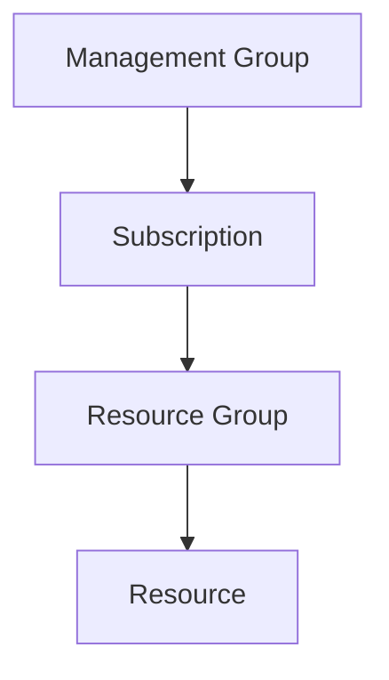
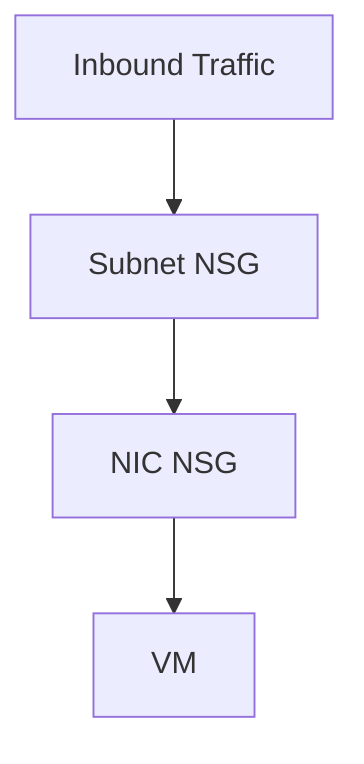
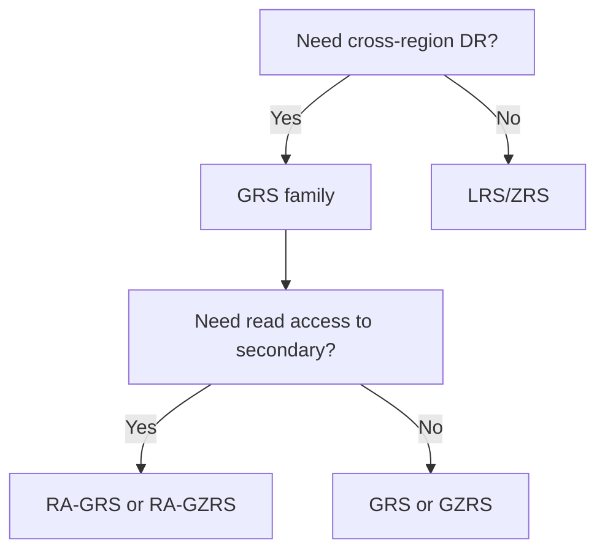

<!--
title: "AZ-104 Ultimate One-Stop Study Guide"
updated: "2026-02-11"
-->

# 🚀 AZ-104 Ultimate One-Stop Study Guide

Microsoft Azure Administrator Associate

This is your centralized command center for passing AZ-104.

------------------------------------------------------------------------

## 📋 Table of Contents

- [📂 Linked Study Assets (Start Here)](#-linked-study-assets-start-here)
- [🧭 Exam Domains & What You MUST Master](#-exam-domains--what-you-must-master)
    - [1️⃣ Identity & Governance (20–25%)](#1️⃣-identity--governance-2025)
    - [2️⃣ Storage (15–20%)](#2️⃣-storage-1520)
    - [3️⃣ Compute (20–25%)](#3️⃣-compute-2025)
    - [4️⃣ Networking (15–20%)](#4️⃣-networking-1520)
    - [5️⃣ Monitoring & Backup (10–15%)](#5️⃣-monitoring--backup-1015)
- [🧠 Architecture Relationships (Know These Visually)](#-architecture-relationships-know-these-visually)
- [🛠 Must-Know CLI Examples](#-must-know-cli-examples)
- [📚 Study Resources](#-study-resources)
- [🎯 Final 7-Day Pass Plan](#-final-7-day-pass-plan)
- [🧪 How to Know You're Ready](#-how-to-know-youre-ready)
- [🏁 Exam-Day Strategy](#-exam-day-strategy)

------------------------------------------------------------------------

## 📂 Linked Study Assets (Start Here)

### Core Documents

- 📘 **Full-Length Detailed Guide**  
    👉 [AZ-104 Full-Length Study Guide](AZ-104-Full-Length-Study-Guide.md)

- 🔥 **Most Failed Areas Breakdown**  
    👉 [AZ-104 Most Failed Areas](AZ-104-Most-Failed-Areas.md)

------------------------------------------------------------------------

## 🧭 Exam Domains & What You MUST Master

### 1️⃣ Identity & Governance (20–25%)

**Focus Areas:**
- Entra ID vs RBAC
- Scope inheritance
- Azure Policy vs Locks
- Conditional Access logic
- Cost management & tagging

**Operational Questions to Expect:**
- Why does user X not have access?
- What scope fixes the issue?
- Which role is correct?

------------------------------------------------------------------------

### 2️⃣ Storage (15–20%)

**Focus Areas:**
- Replication differences (LRS/ZRS/GRS/RA-GRS/GZRS)
- SAS token design
- Storage firewall vs Private Endpoint
- Blob lifecycle rules
- Azure Files + soft delete

**Common Failure:** Choosing wrong replication type for DR requirements.

------------------------------------------------------------------------

### 3️⃣ Compute (20–25%)

**Focus Areas:**
- Availability Sets vs Zones
- Update vs Fault Domains
- VM Scale Sets autoscaling logic
- Disk types & performance tiers
- App Service Plan scaling rules

**Exam Trap:** Scaling the app vs scaling the plan.

------------------------------------------------------------------------

### 4️⃣ Networking (15–20%)

**Focus Areas:**
- NSG rule priority
- NIC vs Subnet evaluation
- UDR override behavior
- Service Endpoint vs Private Endpoint
- Load Balancer vs App Gateway

**Critical Concept:** Traffic must be allowed at ALL evaluation points.

------------------------------------------------------------------------

### 5️⃣ Monitoring & Backup (10–15%)

**Focus Areas:**
- Metrics vs Logs
- KQL basics
- Alert rules + Action Groups
- Recovery Services Vault vs Backup Vault
- Site Recovery failover flow

------------------------------------------------------------------------

## 🧠 Architecture Relationships (Know These Visually)

### Scope Hierarchy



Inheritance flows downward.

------------------------------------------------------------------------

### Network Evaluation Flow



Both must allow traffic.

------------------------------------------------------------------------

### Storage Replication Decision



------------------------------------------------------------------------

## 🛠 Must-Know CLI Examples

### Assign RBAC Role

```bash
az role assignment create \
    --assignee user@domain.com \
    --role "Contributor" \
    --scope /subscriptions/<sub-id>
```

### Create VM

```bash
az vm create \
    --resource-group MyRG \
    --name MyVM \
    --image UbuntuLTS \
    --admin-username azureuser \
    --generate-ssh-keys
```

### Create Metric Alert

```bash
az monitor metrics alert create \
    --name HighCPU \
    --resource-group MyRG \
    --scopes <vm-id> \
    --condition "avg Percentage CPU > 80"
```

------------------------------------------------------------------------

## 📚 Study Resources

### 🔗 Official Microsoft Resources

- [AZ-104 Exam Page](https://learn.microsoft.com/en-us/certifications/exams/az-104)
- [AZ-104 Study Guide](https://learn.microsoft.com/en-us/certifications/resources/study-guides/az-104)
- [Microsoft Learn - AZ-104 Learning Path](https://learn.microsoft.com/en-us/training/courses/az-104t00)

### 🧪 Hands-On Labs

- [AZ-104 Official Labs (GitHub)](https://microsoftlearning.github.io/AZ-104-MicrosoftAzureAdministrator/)
- [Microsoft Learn Sandbox](https://learn.microsoft.com/en-us/training/)

### 📝 Knowledge Checks

**Module-by-module practice quizzes:**

- [Module 01: Identity](https://forms.office.com/r/XZXhb3JUu1)
- [Module 02: Governance and Compliance](https://forms.office.com/r/YMcfAvhWBw)
- [Module 03: Azure Administration](https://forms.office.com/r/QSBpp5FaA0)
- [Module 04: Virtual Networking](https://forms.office.com/r/RhL4A1t2V4)
- [Module 05: Intersite Connectivity](https://forms.office.com/r/cHU2y0EvNP)
- [Module 06: Network Traffic Management](https://forms.office.com/r/q7dVj7HZk6)
- [Module 07: Azure Storage](https://forms.office.com/r/qn0hv65Pss)
- [Module 08: Azure Virtual Machines](https://forms.office.com/r/h1Swqizb8W)
- [Module 09: Serverless Computing](https://forms.office.com/r/KGujDjAqMZ)
- [Module 10: Data Protection](https://forms.office.com/r/T2hm7xRqun)
- [Module 11: Monitoring](https://forms.office.com/r/8TnUxLuq1y)

**Practice Exam:**

- [Practice Assessment for Exam AZ-104: Microsoft Azure Administrator](https://learn.microsoft.com/en-us/credentials/certifications/azure-administrator/practice/assessment?assessment-type=practice&assessmentId=21&practice-assessment-type=certification)

------------------------------------------------------------------------

## 🎯 Final 7-Day Pass Plan

- **Day 1** – Identity & RBAC deep dive
- **Day 2** – Storage + replication mastery
- **Day 3** – Compute & scaling
- **Day 4** – Networking + NSG lab
- **Day 5** – Monitoring + KQL practice
- **Day 6** – Backup + DR flows
- **Day 7** – Full practice exam + review failures

------------------------------------------------------------------------

## 🧪 How to Know You're Ready

You can answer without hesitation:

- Why is traffic blocked?
- Why is user denied?
- Which replication protects from zone failure?
- What scales when I scale an App Service?
- What overrides a system route?

If you must think long — review that domain.

------------------------------------------------------------------------

## 🏁 Exam-Day Strategy

- Read every question twice.
- Identify what layer the issue belongs to (Identity, Network, Compute, Storage).
- Eliminate answers that solve a different layer.
- Watch for wording like:
    - "Least privilege"
    - "Minimize cost"
    - "Zone-level protection"
    - "Cross-region failover"

This exam rewards operational reasoning, not memorization.

------------------------------------------------------------------------

**Master relationships. Not features.**
