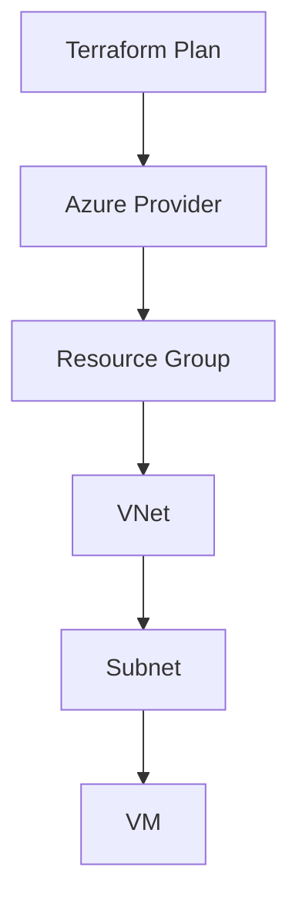

# 🚀 Terraform Advanced Guide

<p align="right"><sub>Last updated: February 1, 2026</sub></p>

**Deep dive into advanced Terraform concepts, patterns, and best practices for cloud infrastructure automation.**

<p align="center">
  <a href="#modules">Modules</a> •
  <a href="#workspaces">Workspaces</a> •
  <a href="#state">State Management</a> •
  <a href="#provisioners">Provisioners</a> •
  <a href="#loops">Loops & Conditionals</a> •
  <a href="#testing">Testing</a> •
  <a href="#security">Security</a> •
  <a href="#references">References</a>
</p>

---

## 🧩 Modules & Reusability <a id="modules"></a>

> **Tip:** Use modules to encapsulate and reuse infrastructure patterns.

```hcl
module "vnet" {
  source = "Azure/vnet/azurerm"
  version = "3.5.0"
  name                = "my-vnet"
  address_space       = ["10.0.0.0/16"]
  subnet_prefixes     = ["10.0.1.0/24"]
  subnet_names        = ["subnet1"]
}
```

---

## 🗂 Workspaces <a id="workspaces"></a>

> **Workspaces** let you manage multiple environments (dev, staging, prod) with the same codebase.

```sh
terraform workspace new dev
terraform workspace select dev
terraform apply
```

---

## 🗃 State Management <a id="state"></a>

- Use remote backends (Azure Storage, S3, GCS) for team collaboration and state locking.
- Enable state encryption and versioning.

```hcl
terraform {
  backend "azurerm" {
    resource_group_name  = "tfstate-rg"
    storage_account_name = "tfstateprod"
    container_name       = "tfstate"
    key                  = "prod.terraform.tfstate"
  }
}
```

---

## ⚙️ Provisioners & Null Resources <a id="provisioners"></a>

> **Provisioners** run scripts or configuration after resource creation (use sparingly).

```hcl
resource "null_resource" "example" {
  provisioner "local-exec" {
    command = "echo Hello, World!"
  }
}
```

---

## 🔁 Loops & Conditionals <a id="loops"></a>

- Use `for_each` and `count` for dynamic resource creation.
- Use ternary operators for conditional logic.

```hcl
resource "azurerm_network_interface" "example" {
  count = var.create_nic ? 1 : 0
  name = "example-nic"
  # ...
}

resource "azurerm_subnet" "subnets" {
  for_each = var.subnets
  name     = each.key
  address_prefix = each.value
  # ...
}
```

---

## 🧪 Testing & Validation <a id="testing"></a>

- Use `terraform validate` and `terraform fmt` for syntax and style.
- Use [Terratest](https://terratest.gruntwork.io/) or [kitchen-terraform](https://newcontext-oss.github.io/kitchen-terraform/) for automated testing.

---

## 🔒 Security Best Practices <a id="security"></a>

- Never commit secrets or state files to version control.
- Use environment variables or secret managers for sensitive data.
- Enable state file encryption.
- Use [tfsec](https://aquasecurity.github.io/tfsec/) or [Checkov](https://www.checkov.io/) for static code analysis.

---

## 🗺️ Example Architecture (Mermaid)



---

## 📚 References <a id="references"></a>

- [Terraform Official Docs](https://www.terraform.io/docs)
- [Terraform Azure Provider](https://registry.terraform.io/providers/hashicorp/azurerm/latest/docs)
- [Terraform Module Registry](https://registry.terraform.io/)
- [Terratest](https://terratest.gruntwork.io/)
- [tfsec](https://aquasecurity.github.io/tfsec/)
- [Checkov](https://www.checkov.io/)

---

<p align="right"><a href="../README.md">Back to Student Resources</a></p>
